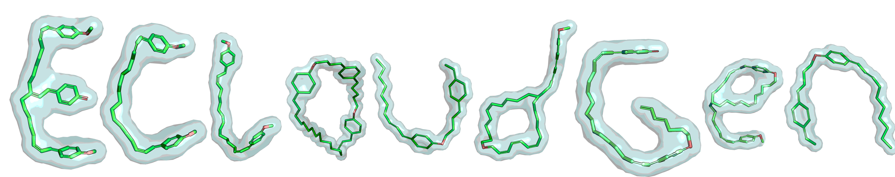

<div align=center>

</div>


ECloudGen
=======

  

This figure represent: Electron Clouds; Protein-Ligand Interactions; Latent Diffusion Process

## Environment 

### Install via conda yaml file (cuda 12.1)

```python
conda env create -f ecloudgen_env.yml
conda activate ecloudgen 
```

### Install manually 

This environment has been successfully tested on CUDA==12.1

```
# recommend using numpy<2
mamba create -n ecloudgen pytorch==2.2.2 torchvision==0.17.2 torchaudio==2.2.2 pytorch-cuda=12.1 plyfile pyg rdkit biopython easydict jupyter ipykernel lmdb mamba moleculekit openbabel scikit-learn scipy omegaconf einops accelerate h5py wandb xtb ignite gpytorch altair -c pytorch -c nvidia -c pyg -c conda-forge -c acellera

conda activate ecloudgen

# optional 
pip install pyg_lib torch_scatter torch_sparse torch_cluster torch_spline_conv -f https://data.pyg.org/whl/torch-2.2.0+cu121.html 
```

## Data 

### ECloudDiff dataset preparation. 

You can download the raw data as provided in [ResGen](https://github.com/HaotianZhangAI4Science/ResGen). You can also download the processed protein-ligand pair from the [this link](https://drive.google.com/drive/folders/1CzwxmTpjbrt83z_wBzcQncq84OVDPurM). 

Note: [index.pkl](https://github.com/HaotianZhangAI4Science/ResGen/tree/main/data/crossdocked_pocket10),  [split_by_name.pt](https://github.com/HaotianZhangAI4Science/ResGen/tree/main/data). are automatically downloaded with the SurfGen code.  index.pkl saves the information of each protein-ligand pair, while split_by_name.pt save the train-test split of the dataset.

```shell
tar -xzvf crossdocked_pocket10.tar.gz
# Then follow the ./dataset/readme.md for processing protein-ligand dataset from scratch. 
```

### ECloudDecipher dataset preparation. 

see `ECloudGen/dataset/02_generate_ligecloud_data.py`

## Generation 

You can download the [pretrained checkpoints](https://zenodo.org/records/14935431), and put them in the `ECloudGen/model_ckpts` .

<div align=center>

</div>


```shell
# modify the data path and batch_size in the ./configs/eclouddiff.yml 
python generate_from_pdb.py --pdb_file pdb_file ./play_around/peptide_example/7ux5_protein.pdb --lig_file ./play_around/peptide_example/7ux5_peptide.sdf --outputs_dir results
```

Generate from ECloud, ECloud can be from ECloudDiff module or from the hit ligands. 

```shell
python generate_from_ecloud.py --input_ecloud play_around/example/BRD4_gen_ecloud.npy --model model_ckpts/ecloud_smiles_67.pkl --num_gen 100 --batch_size 32 --noise 0.6 --output output/test.sdf
```

## Optimization 

The model-agnostic optimizer can be found at `ECloudGen/play_around/model_agnostic_optimizer.ipynb`

## Training 

The training process is released as train.py, the following command is an example of how to train a model.

```shell
# modify the data path and batch_size in the ./configs/eclouddiff.yml 
python train_eclouddiff.py 
python train_eclouddecipher.py
```


