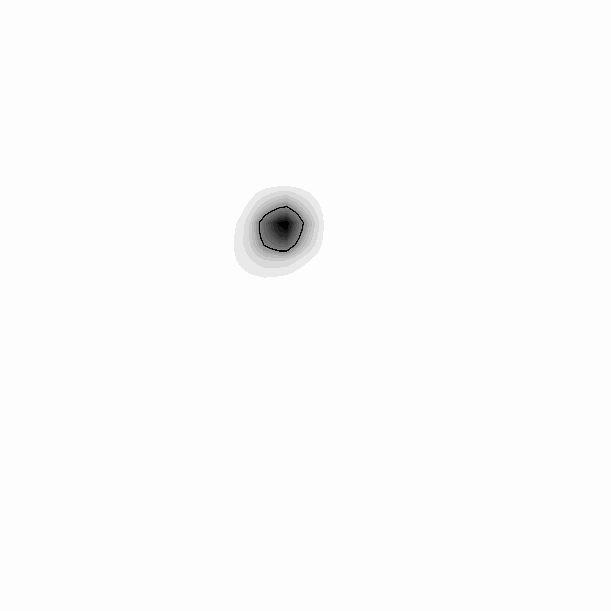
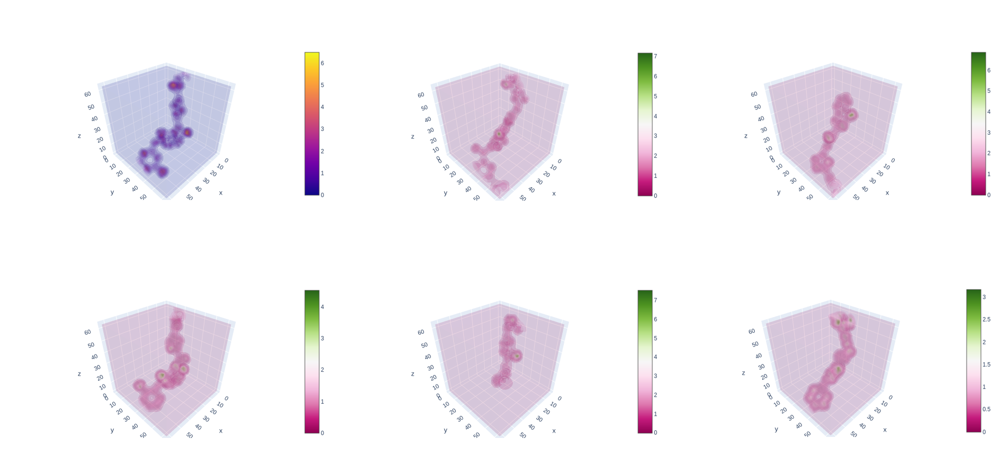

ECloudGen
=======

  

This figure represent: Electron Clouds; Protein-Ligand Interactions; Latent Diffusion Process

## Environment 

### Install via conda yaml file (cuda 11.3)

```python
conda env create -f ecloudgen.yml
conda activate ecloudgen 
```

### Install manually 

This environment has been successfully tested on CUDA==11.3

```
conda create -n ecloudgen rdkit openbabel moleculekit scikit-learn scipy jupyter python-lmdb pytorch cudatoolkit=11.3 omegaconf einops accelerate h5py wandb xtb ignite gpytorch altair python=3.9 -c conda-forge 
```

## Data 

### Protein-ligand pair dataset preparation. 

You can download the raw data as provided in [ResGen](https://github.com/HaotianZhangAI4Science/ResGen). You can also download the processed protein-ligand pair from the [this link](https://drive.google.com/drive/folders/1CzwxmTpjbrt83z_wBzcQncq84OVDPurM). 

Note: [index.pkl](https://github.com/HaotianZhangAI4Science/ResGen/tree/main/data/crossdocked_pocket10),  [split_by_name.pt](https://github.com/HaotianZhangAI4Science/ResGen/tree/main/data). are automatically downloaded with the SurfGen code.  index.pkl saves the information of each protein-ligand pair, while split_by_name.pt save the train-test split of the dataset.

```shell
tar -xzvf crossdocked_pocket10.tar.gz
# Then follow the ./dataset/readme.md for processing protein-ligand dataset from scratch. 
```

## Generation 

<div align=center>

</div>


## Training 

The training process is released as train.py, the following command is an example of how to train a model.

```shell
# modify the data path and batch_size in the ./configs/eclouddiff.yml 
python train_eclouddiff.py 
```


